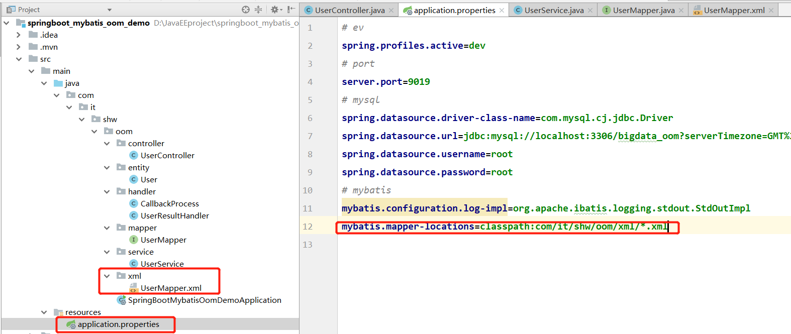
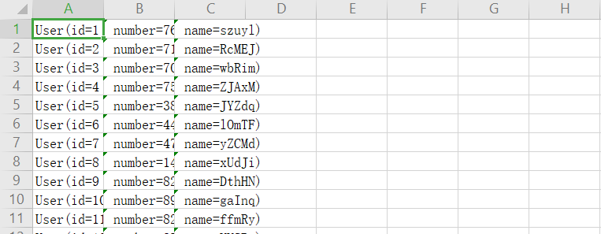

## 一、背景

-  动态数据导出是一般项目都会涉及到的功能。它的基本实现逻辑就是从数据库查询数据，加载到内存，然后从内存创建excel或者csv，以流的形式响应给前端，通过浏览器下载到本地
-  然而一旦数据量太大，达到十万级，百万级，千万级，大规模数据加载到内存必然会引起**OutofMemoryError**
-  如何解决，本文提供了完整的解决方案

## 二、如何避免OOM 

### 1、产品角度

-  我们为什么要导出这么多数据呢？这个设计是不是合理的呢？ 
-  如果要导出百万级数据，那为什么不直接找大数据或者DBA来干呢？然后以邮件形式传递不行吗？ 
-  如果通过分页导出，每次点击按钮只导几万条，分批导出难道不能满足业务需求吗？
-  如果产品缺个筋，听不懂你的话，坚持要一次性导出全量数据，那就只能从技术实现上考虑如何实现了 

### 2、技术角度

-  不能将全量数据一次性加载到内存之中，这可以通过采用**stream**流方式实现
-  以**csv**代替excel，减少文件结构存储空间

## 三、基于Mybatis实现方案

### 1、书写Mapper

```java
@Mapper
public interface UserMapper {
    List<User> getAllUserList();
}
```

### 2、书写XML文件

- fetchSize表示每次读取数据1000条到内存

```xml
<mapper namespace="com.it.shw.oom.mapper.UserMapper">
    <select id="getAllUserList" resultType="com.it.shw.oom.entity.User" fetchSize="1000">
        SELECT * from tb_user
    </select>
</mapper>
```

#### **注意**

- 配置xml扫描路径



- pom文件配置文件类型加载

```xml
<build>
    <plugins>
        <plugin>
            <groupId>org.springframework.boot</groupId>
            <artifactId>spring-boot-maven-plugin</artifactId>
        </plugin>
    </plugins>
    <!-- 扫描xml、properties文件 -->
    <resources>
        <resource>
            <directory>src/main/java</directory>
            <includes>
                <include>**/*.properties</include>
                <include>**/*.xml</include>
            </includes>
            <filtering>false</filtering>
        </resource>
        <resource>
            <directory>src/main/resources</directory>
            <includes>
                <include>**/*.properties</include>
                <include>**/*.xml</include>
            </includes>
            <filtering>false</filtering>
        </resource>
    </resources>
</build>
```

### 3、书写结果集处理器

```java
public class UserResultHandler<T> implements ResultHandler<T> {
    // 每批处理的大小
    private final int batchSize;
    // 每批当前待处理数据个数
    private int count;
    // 存储每批数据的临时容器
    private List<T> results;
    // 处理器
    private final CallbackProcess callbackProcess;

    // 构造函数
    public UserResultHandler(CallbackProcess callbackProcess, int batchSize) {
        super();
        this.callbackProcess = callbackProcess;
        this.batchSize = batchSize;
        count = 0;
        results = new ArrayList<>();
    }

    @Override
    public void handleResult(ResultContext resultContext) {
        T resultObject = (T) resultContext.getResultObject();
        results.add(resultObject);
        count++;
        if (count == batchSize) {
            callbackProcess.processData(results);
            // 重置临时数据容器
            clear();
        }
    }

    // 用来完成最后一批数据处理
    public void end() {
        if (count > 0) {
            callbackProcess.processData(results);
            // 重置临时数据容器
            clear();
        }
    }

    // 重置临时数据容器
    public void clear() {
        count = 0;
        results.clear();
    }
}
```

### 4、书写回调过程

```java
public class CallbackProcess {

    // 输出流-浏览器
    private final HttpServletResponse response;

    // 构造函数
    public CallbackProcess(HttpServletResponse response) {
        this.response = response;
    }

    // 处理数据
    public <E> void processData(List<E> records) {
        try {
            for (E record : records) {
                // 需要重写toString,属性通过","分割
                response.getWriter().write(record.toString());
                response.getWriter().write("\n");
            }
        } catch (Exception e) {
            e.printStackTrace();
        }
    }
}
```

### 5、书写service层方法

```java
@Autowired
private SqlSessionTemplate sqlSessionTemplate;

public void exportUserWithCsv(HttpServletResponse response) {
    // 结果集处理回调过程
    CallbackProcess callbackProcess = new CallbackProcess(response);
    // 结果集分批处理
    UserResultHandler userResultHandler = new UserResultHandler<User>(callbackProcess, 												1000);
    sqlSessionTemplate.select("com.it.shw.oom.mapper.UserMapper.getAllUserList", 																	userResultHandler);
    // 处理最后一批数据
    userResultHandler.end();
}
```

### 6、书写controller层方法

```java
@GetMapping(value = "/export")
public void testCsvExport(HttpServletResponse response) {
    String fileName = System.currentTimeMillis() + ".csv";
    response.addHeader("Content-Type", "application/csv");
    response.addHeader("Content-Disposition", "attachment; filename=" + fileName);
    response.setCharacterEncoding("UTF-8");
    userService.exportUserWithCsv(response);
}
```

### 7、效果展示

- 浏览器输入网址如： http://localhost:9019/user/export 



## 源码链接

- https://github.com/ThailandKing/springboot_mybatis_oom_demo.git

